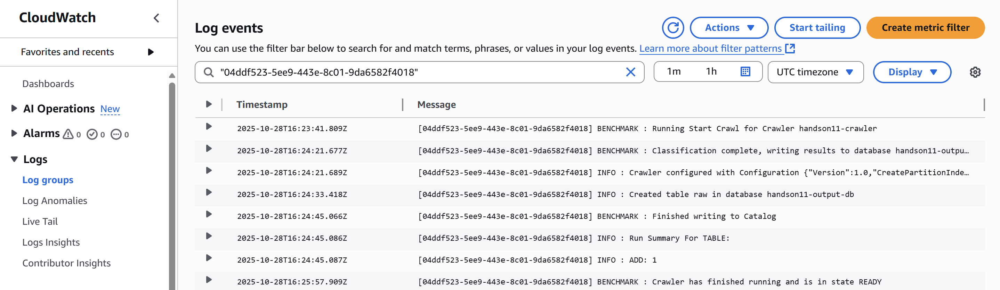
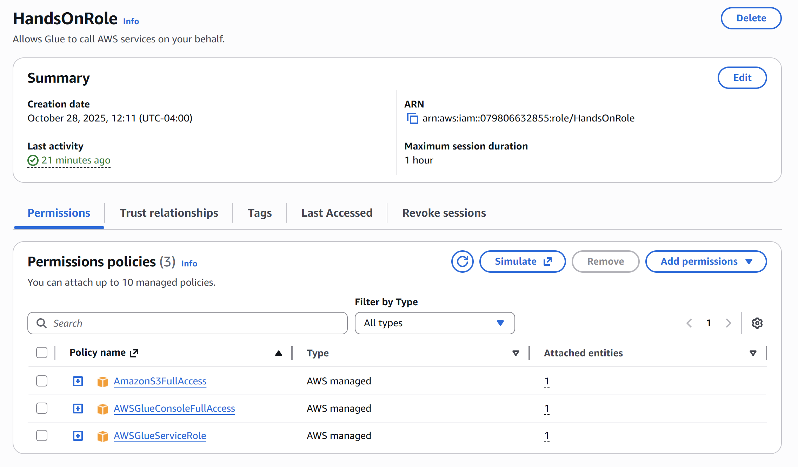
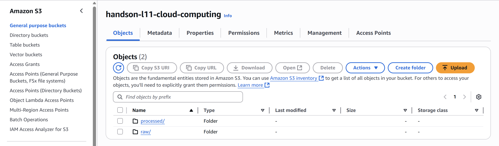

# AWS E-Commerce Analytics Pipeline (S3 • Glue • Athena)

---

## 📘 Overview

This project implements a complete AWS-based data analytics pipeline for processing and analyzing an E-Commerce Sales Dataset (from Kaggle).
The pipeline demonstrates how key AWS services, S3, Glue, Athena, and CloudWatch, can be integrated to create a scalable, serverless, and cost-effective analytics workflow.

---

## 🧱 AWS Architecture

| Service | Purpose |
|----------|----------|
| **Amazon S3** | Store raw and processed CSV data. |
| **AWS Glue** | Crawl data and create metadata tables in the Data Catalog. |
| **Amazon Athena** | Query the crawled data using SQL. |
| **Amazon CloudWatch** | Monitor Glue crawler logs and performance. |
| **AWS IAM** | Manage permissions for Glue and Athena through an execution role. |

**Bucket:** `s3://handson-l11-cloud-computing`  
- Raw Data: `raw/Amazon Sale Report.csv`  
- Processed Data: `processed/`

**IAM Role:** `HandsOnRole`  
ARN: `arn:aws:iam::079806632855:role/HandsOnRole`

**Glue Database:** `handson11-output-db`  
**Table:** `raw`

---

## 🪜 Workflow Steps

### 1️⃣ Configure Amazon S3
- Created bucket: `handson-l11-cloud-computing`
- Uploaded dataset: `Amazon Sale Report.csv` → `raw/` folder

### 2️⃣ Create IAM Role
- Role name: `HandsOnRole`
- Attached permissions:  
  - `AmazonS3FullAccess`  
  - `AWSGlueServiceRole`  
  - `CloudWatchFullAccess`

### 3️⃣ Create Glue Crawler
- Source: `s3://handson-l11-cloud-computing/raw/`
- Target Database: `handson11-output-db`
- IAM Role: `HandsOnRole`
- Result: Table `raw` successfully created in Glue Catalog

### 4️⃣ Monitor in CloudWatch
- Checked `/aws-glue/crawlers` log group  
- Verified crawler success message

### 5️⃣ Query in Athena
- Data source: **AwsDataCatalog → handson11-output-db → raw**
- Five analytical queries executed with `LIMIT 10`.

---

## 📜 Athena SQL (exact queries used)

### Q1 — Cumulative Sales Over Time (Year = 2022)
```sql
USE "handson11-output-db";

WITH base AS (
  SELECT
    COALESCE(
      try(date_parse("Date", '%m/%d/%Y')),
      try(date_parse("Date", '%m-%d-%y')),
      try(date_parse("Date", '%m/%d/%y'))
    )                       AS order_dt,
    try_cast("Amount" AS double) AS amount
  FROM "raw"
)
SELECT
  order_dt,
  SUM(amount) OVER (
    ORDER BY order_dt
    ROWS BETWEEN UNBOUNDED PRECEDING AND CURRENT ROW
  ) AS cumulative_sales
FROM base
WHERE order_dt IS NOT NULL
  AND year(order_dt) = 2022
ORDER BY order_dt
LIMIT 10;
```

### Q2 — Geographic Hotspot (proxy: cancellations/returns/refunds as negative revenue)
```sql
USE "handson11-output-db";

SELECT
  "ship-state"                     AS state,
  SUM(-1 * try_cast("Amount" AS double)) AS total_negative_revenue
FROM "raw"
WHERE lower("Status") IN ('cancelled','returned','refund')
  AND "ship-state" IS NOT NULL
GROUP BY "ship-state"
ORDER BY total_negative_revenue ASC
LIMIT 10;
```

### Q3 — Discounts vs Profitability by Sub-Category (proxy: promotion present)
```sql
USE "handson11-output-db";

SELECT
  "Category"                                                          AS sub_category,
  CASE
    WHEN COALESCE(NULLIF(TRIM("promotion-ids"), ''), '') <> '' THEN 'Promo'
    ELSE 'No Promo'
  END                                                                 AS discount_flag,
  SUM(try_cast("Amount" AS double))                                   AS total_sales,
  SUM(try_cast("Qty" AS integer))                                     AS total_units,
  CASE WHEN SUM(try_cast("Qty" AS integer)) > 0
       THEN SUM(try_cast("Amount" AS double)) / SUM(try_cast("Qty" AS integer))
       ELSE NULL
  END                                                                 AS sales_per_unit_proxy
FROM "raw"
GROUP BY "Category",
         CASE
           WHEN COALESCE(NULLIF(TRIM("promotion-ids"), ''), '') <> '' THEN 'Promo'
           ELSE 'No Promo'
         END
ORDER BY sub_category, discount_flag
LIMIT 10;
```

### Q4 — Top 3 Products by Category (proxy: rank by total sales)
```sql
USE "handson11-output-db";

WITH product_totals AS (
  SELECT
    "Category"                              AS category,
    "SKU"                                   AS sku,
    SUM(try_cast("Amount" AS double))       AS total_sales
  FROM "raw"
  GROUP BY "Category", "SKU"
),
ranked AS (
  SELECT
    category,
    sku,
    total_sales,
    RANK() OVER (PARTITION BY category ORDER BY total_sales DESC) AS rnk
  FROM product_totals
)
SELECT category, sku, total_sales, rnk
FROM ranked
WHERE rnk <= 3
ORDER BY category, rnk, total_sales DESC
LIMIT 10;
```

### Q5 — Monthly Sales & Profit Growth (profit proxy = sales)
```sql
USE "handson11-output-db";

WITH base AS (
  SELECT
    date_trunc(
      'month',
      COALESCE(
        try(date_parse("Date", '%m/%d/%Y')),
        try(date_parse("Date", '%m-%d-%y')),
        try(date_parse("Date", '%m/%d/%y'))
      )
    )                             AS month,
    try_cast("Amount" AS double)  AS amount
  FROM "raw"
),
monthly AS (
  SELECT
    month,
    SUM(amount) AS total_sales,
    SUM(amount) AS profit_proxy
  FROM base
  WHERE month IS NOT NULL
  GROUP BY 1
)
SELECT
  month,
  total_sales,
  profit_proxy,
  (total_sales - LAG(total_sales) OVER (ORDER BY month))
    / NULLIF(LAG(total_sales) OVER (ORDER BY month), 0)   AS sales_growth_mom,
  (profit_proxy - LAG(profit_proxy) OVER (ORDER BY month))
    / NULLIF(LAG(profit_proxy) OVER (ORDER BY month), 0)  AS profit_growth_mom
FROM monthly
ORDER BY month
LIMIT 10;
```

---

## 📊 Query Results

### **Q1 – Cumulative Sales Over Time**
| # | order_dt | cumulative_sales |
|--|-----------|------------------|
| 1 | 2022-03-31 | 1415.00 |
| 2 | 2022-03-31 | 2113.00 |
| 3 | 2022-03-31 | 3609.00 |
| 4 | 2022-03-31 | 4297.00 |
| 5 | 2022-03-31 | 4746.00 |
| 6 | 2022-03-31 | 5106.95 |
| 7 | 2022-03-31 | 5459.95 |
| 8 | 2022-03-31 | 5912.95 |
| 9 | 2022-03-31 | 6703.95 |
| 10 | 2022-03-31 | 566.00 |

---

### **Q2 – Geographic “Hotspot” for Unprofitable Products**
| # | ship-state | total_negative_revenue |
|--|-------------|------------------------|
| 1 | MAHARASHTRA | -1,098,378.88 |
| 2 | KARNATAKA | -827,075.43 |
| 3 | UTTAR PRADESH | -625,327.70 |
| 4 | TELANGANA | -623,979.60 |
| 5 | TAMIL NADU | -552,632.07 |
| 6 | KERALA | -436,944.55 |
| 7 | ANDHRA PRADESH | -335,425.24 |
| 8 | DELHI | -329,126.97 |
| 9 | WEST BENGAL | -292,916.99 |
| 10 | GUJARAT | -240,943.82 |

---

### **Q3 – Impact of Discounts on Profitability by Sub-Category**
| # | sub_category | discount_flag | total_sales | total_units | sales_per_unit_proxy |
|--|---------------|---------------|--------------|--------------|----------------------|
| 1 | Blouse | No Promo | 189,719.18 | 357 | 531.43 |
| 2 | Blouse | Promo | 268,689.00 | 506 | 531.01 |
| 3 | Bottom | No Promo | 42,746.98 | 102 | 419.09 |
| 4 | Bottom | Promo | 107,921.00 | 296 | 364.60 |
| 5 | Dupatta | Promo | 915.00 | 3 | 305.00 |
| 6 | Ethnic Dress | No Promo | 299,233.66 | 396 | 755.64 |
| 7 | Ethnic Dress | Promo | 491,984.00 | 657 | 748.83 |
| 8 | Saree | No Promo | 30,401.76 | 32 | 950.06 |
| 9 | Saree | Promo | 93,532.00 | 120 | 779.43 |
| 10 | Set | No Promo | 11,161,675.90 | 12,020 | 928.59 |

---

### **Q4 – Top 3 Most Profitable Products Within Each Category**
| # | category | sku | total_sales | rank |
|--|-----------|-----|--------------|------|
| 1 | Blouse | J0217-BL-M | 24,288.90 | 1 |
| 2 | Blouse | J0217-BL-L | 20,908.33 | 2 |
| 3 | Blouse | J0217-BL-S | 20,670.99 | 3 |
| 4 | Bottom | BTM038-PP-S | 2,989.90 | 1 |
| 5 | Bottom | BTM039-PP-XXXL | 2,862.86 | 2 |
| 6 | Bottom | BTM039-PP-M | 2,828.58 | 3 |
| 7 | Dupatta | DPT032 | 305.00 | 1 |
| 8 | Dupatta | DPT052 | 305.00 | 1 |
| 9 | Dupatta | DPT041 | 305.00 | 1 |
| 10 | Ethnic Dress | J0006-SET-M | 73,072.95 | 1 |

---

### **Q5 – Monthly Sales and Profit Growth Analysis**
| # | month | total_sales | profit_proxy | sales_growth_mom | profit_growth_mom |
|--|--------|--------------|---------------|------------------|-------------------|
| 1 | 2022-03-01 | 101,683.85 | 101,683.85 | — | — |
| 2 | 2022-04-01 | 28,838,708.32 | 28,838,708.32 | 282.61% | 282.61% |
| 3 | 2022-05-01 | 26,226,476.75 | 26,226,476.75 | -9.06% | -9.06% |
| 4 | 2022-06-01 | 23,425,809.38 | 23,425,809.38 | -10.68% | -10.68% |

---

## 📁 Repository Structure

```
aws-ecommerce-analytics-s3-glue-athena-pipeline/
├── README.md
├── queries/
│   └── queries.sql
├── results/
│   ├── q1_cumulative_sales.csv
│   ├── q2_unprofitable_hotspots.csv
│   ├── q3_discount_vs_profitability.csv
│   ├── q4_top3_by_category.csv
│   └── q5_monthly_growth.csv
└── screenshots/
    ├── cloudwatch_crawler2.png
    ├── iam_role.png
    └── s3_bucket.png
```

---

### AWS Service Screenshots
1. **CloudWatch Logs** – `/aws-glue/crawlers`  
   
2. **IAM Role (`HandsOnRole`)** – attached policies  
   
3. **S3 Bucket Structure** – `raw/` and `processed/`  
   

---
